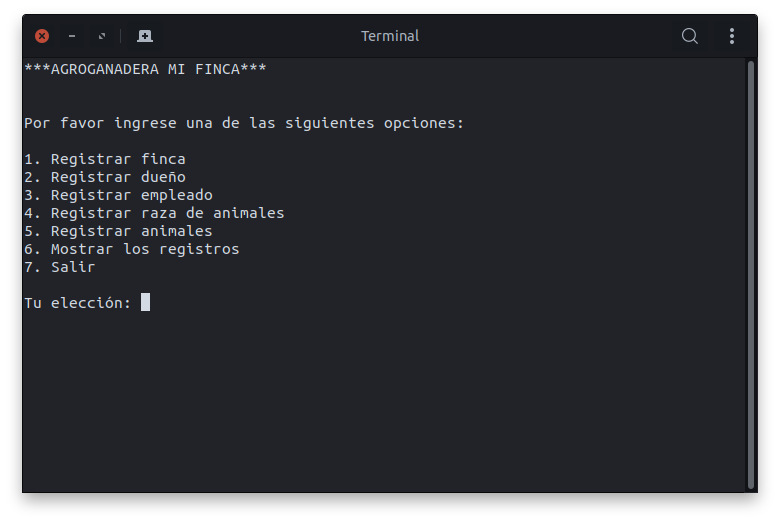
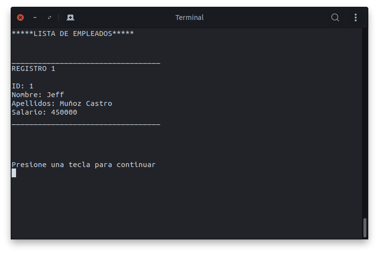
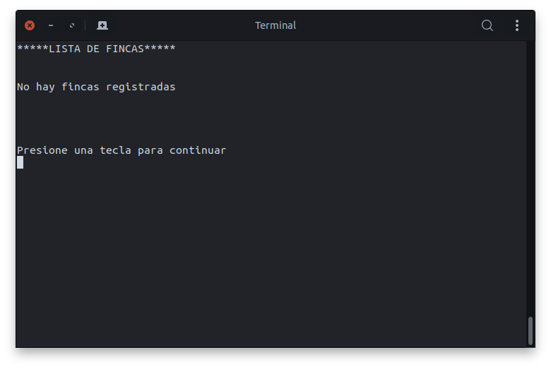

        

# Agroganadería Mi Finca

## Tarea 1 programación avanzada UNED (I CUATRIMESTRE 2021)

## Sistema de automatización de procesos administrativos (programa de consola)

## Programado con:

* C#
* Monodevelop 7.8.4
* Ubuntu 20.04

## Imágenes

